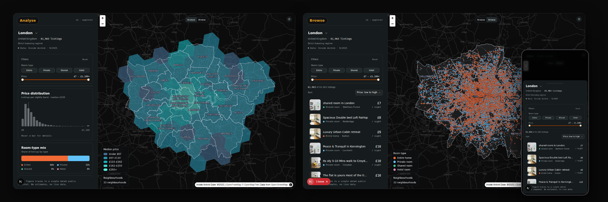

# Plainsight Case Study

## Thesis

Plainsight is a frontend-first geospatial analysis app designed around
persistent map rendering, large client-side datasets, shared calculation logic,
off-thread analysis, URL-restorable state, and explicit lifecycle orchestration.

The goal was not to build another mostly static app. I chose a
map-based market explorer because it creates real frontend complexity: a
client-only map, large local datasets, asynchronous computation, route
transitions, restored interaction state, and dense responsive UI.

---

## 1. Overview

Plainsight is a public, read-only short-term-rental market explorer built on
dated Inside Airbnb snapshots.

It helps a research-oriented user explore:

- where listings are concentrated;
- what they cost;
- how prices vary by area;
- how the market is distributed by room type;
- which hosts control larger portions of the market;
- which individual public listings sit behind the aggregate patterns.

The app currently supports London, Berlin, Manchester, and Amsterdam. Users move
between two lenses over the same map:

- **Analyse** — city-wide spatial patterns, H3 price hexes, KPIs, charts, and
  host structure.
- **Browse** — individual public listings shown as map points and a virtualized
  list.

Live demo: https://plainsight-theta.vercel.app/

---

## 2. Why this problem

A short-term-rental map explorer is visual, data-heavy, interaction-heavy, and
stateful. It naturally creates product pressures that are difficult to show in a
simple CRUD project:

| Product pressure                   | Why it matters                                                                                      |
| ---------------------------------- | --------------------------------------------------------------------------------------------------- |
| Expensive client-only map          | The MapLibre instance should not be recreated on every city navigation.                             |
| Large local datasets               | Filtering and aggregation must not freeze the map, list, drawer, or controls.                       |
| Shared analysis and browsing state | Filters, scope, map layers, summaries, and listings must agree.                                     |
| Route transitions                  | Worker replies, selections, and map events from the previous city must not leak into the next city. |
| Restorable exploration             | Users should be able to reopen the same lens, scope, filters, and listing.                          |
| Visual-first UI                    | The map should enhance exploration, not become the only way to operate the app.                     |
| Public data                        | The app must present dated observations honestly and not invent live availability.                  |

The architecture follows from those pressures. Persistent layouts, XState, Web
Workers, H3 aggregation, URL state, and snapshot tiers are not included to make
the stack look bigger; each one addresses a specific constraint.

---

## 3. Public demo scope

The public version is intentionally scoped as a read-only demo using curated
snapshots.

That keeps the project:

- reproducible for reviewers;
- understandable without accounts or setup;
- suitable for low-cost public deployment;
- legally and operationally simpler;
- focused on frontend architecture rather than backend administration.

Static snapshots are a demo boundary, not the only possible product direction. A
future version could support imported city datasets, but that would require file
validation, schema feedback, storage decisions, privacy rules, moderation
boundaries, cost controls, and a practical way to test imported data quality.

---

## 4. Architecture response

| Constraint                | Response                                                                                             |
| ------------------------- | ---------------------------------------------------------------------------------------------------- |
| Expensive client-only map | Keep the map mounted in a persistent scene layout above the city route segment.                      |
| Large analytical work     | Move Analyse projections and aggregation into a Web Worker.                                          |
| Browse evidence           | Serve Browse from prebuilt points cached by TanStack Query and filtered client-side.                 |
| Spatial analysis          | Use H3 cells for city-wide Analyse patterns and individual points for Browse.                        |
| Shared lifecycle          | Use an XState actor system for route, map, UI, worker, and city coordination.                        |
| Shareable state           | Mirror settled lens, scope, filters, and selection into the URL.                                     |
| Public demo boundary      | Use curated, dated, attributed Inside Airbnb snapshots as static assets.                             |
| Calculation integrity     | Use shared projection logic for materialized aggregates, worker recomputation, and Browse filtering. |

The result is a frontend-owned scene subsystem. Next.js provides static routes
and server-readable snapshot tiers. The browser owns the interactive analytical
workspace.

Detailed engineering docs live in [`docs/`](docs/README.md). This case study
keeps the story at case study level instead of repeating every architecture rule.

---

## 5. Persistent map and scene lifecycle

The map is the most expensive part of the interface. It is client-only, owns an
imperative MapLibre instance, loads external tiles, manages layers, and reacts to
user interaction.

Placing it inside every city page would make each city navigation feel like a
full scene reset. Plainsight keeps the map mounted in the scene layout while the
city-specific panel and data change around it.

That improves continuity, but it introduces a correctness risk: during
navigation, the previous city may still be visible while the next route and data
are loading. Plainsight handles that through an explicit suppression window:

- navigation intent starts before the new route fully settles;
- map and UI interaction are suspended while the city switch is in progress;
- stale hover and selection are cleared;
- the active city actor is replaced;
- interaction resumes only when the new city is ready or has failed safely.

The point is not to hide navigation. The point is to prevent stale interaction,
for example clicking a London listing as if it belonged to Berlin during a city
change.

---

## 6. State orchestration

Plainsight uses XState where the hard problem is lifecycle coordination.

| Actor      | Lifetime        | Responsibility                                                             |
| ---------- | --------------- | -------------------------------------------------------------------------- |
| root       | scene session   | city replacement, suppression, resume, and URL write gating                |
| navigation | scene session   | route intent and committed path changes                                    |
| map        | scene session   | MapLibre readiness, feature-state painting, and interaction gating         |
| UI         | scene session   | lens, hover, selected listing, and navigation-time event drop window       |
| worker     | scene session   | worker load, process, cancellation, and stale reply routing                |
| city       | per active city | active city filters, Analyse/Browse leg, load status, and result freshness |

A simpler store can hold values, but the main problem here is not only storing
values. It is deciding when events are valid, which actor owns a lifecycle, what
should be ignored during navigation, and how stale async results are prevented
from affecting the current city.

The detailed actor topology and runtime sequences are documented in
[`docs/runtime-orchestration.md`](docs/runtime-orchestration.md).

---

## 7. Data, performance, and calculation integrity

Plainsight uses dated public snapshots transformed into static application
assets. The data model is tiered so each surface loads only what it needs.

| Technique                | Purpose                                                                          |
| ------------------------ | -------------------------------------------------------------------------------- |
| Preprocessed city assets | Avoid parsing and reshaping raw source data at runtime.                          |
| Snapshot tiers           | Separate server-readable summaries from larger browser-facing assets.            |
| Shared projection core   | Keep materialized summaries, worker recomputation, and Browse filtering aligned. |
| TanStack Query           | Cache public city assets and make revisits faster.                               |
| Web Worker               | Move expensive Analyse projections off the main thread.                          |
| H3 aggregation           | Represent city-wide spatial price patterns as inspectable hex cells.             |
| Virtualized list         | Browse large result sets without rendering every row at once.                    |
| URL selection model      | Reopen an exploration without rebuilding unrelated state manually.               |

The shared calculation core is important. Server/RSC code reads committed
materialized aggregate tiers for page-start KPIs. The offline generator, client
worker, and Browse projections use the same pure listing/filter calculation
modules, so the user does not see one calculation model at page load and another
after interaction.

---

## 8. Design system and accessibility

Plainsight is a dense visual interface, so the design system is not only
cosmetic. Shared tokens, spacing rhythm, panel/drawer composition, theme support,
and consistent interaction states keep the map, controls, charts, and listing
surfaces readable as one product.

Accessibility is part of the product architecture because map-first interfaces
can easily become visual-only experiences.

The working rule is:

> The map should enhance spatial exploration, but it should not be the only way
> to understand or operate the app.

That means core actions use semantic controls, filters have keyboard paths,
important counts and selections are available as text, color is not the only
carrier of meaning, and listing inspection is available through Browse instead
of only through map points.

---

## 9. Testing and confidence

Plainsight's tests are organized around the risks the app actually has.

| Risk                            | Confidence layer                                                                                            |
| ------------------------------- | ----------------------------------------------------------------------------------------------------------- |
| Pure data logic breaks          | Unit tests for filters, projections, sorting, search params, and geospatial helpers.                        |
| Materialized aggregates drift   | Generator tests rebuild aggregate tiers from analytics rows and compare the output.                         |
| State coordination regresses    | Machine tests for navigation, suppression, stale results, and actor transitions.                            |
| Rendered behavior changes       | UI integration tests using user-visible queries.                                                            |
| Accessibility semantics regress | axe checks and keyboard-focused interaction tests.                                                          |
| Real browser workflows fail     | Playwright E2E tests for city selection, lens switching, filtering, Browse inspection, and URL restoration. |
| Performance budgets drift       | Lighthouse/CI checks for selected routes and layout metrics.                                                |

The goal is not coverage for its own sake. The goal is to protect the contracts
most likely to break in a map-heavy, stateful, data-driven frontend.

---

## 10. Tradeoffs and limitations

| Limitation                           | Reason                                                                                                 |
| ------------------------------------ | ------------------------------------------------------------------------------------------------------ |
| Data is static, not live             | The public demo prioritizes reproducibility, attribution, and low operational cost.                    |
| No booking availability              | The source data does not provide a reliable live booking workflow, so the app does not invent one.     |
| No user-uploaded datasets            | Imports would require validation, storage, privacy rules, moderation, cost controls, and more testing. |
| Browser-side data has limits         | Large snapshots need careful tiering, caching, and worker boundaries.                                  |
| Map accessibility is difficult       | The map is treated as an enhancement while non-map workflows continue to improve.                      |
| No formal WCAG conformance claim yet | Automated checks help, but formal conformance requires manual evaluation across workflows and devices. |

Plainsight is optimized as a public case study for frontend architecture, not as
a full production SaaS product.

---

## 11. What this demonstrates

Plainsight demonstrates that I can design a frontend system around real product
constraints rather than defaulting to framework patterns.

It shows experience with:

- geospatial interfaces and map rendering;
- data-heavy browser applications;
- frontend architecture and module boundaries;
- event-driven state orchestration;
- async lifecycle and stale-result protection;
- Web Worker performance boundaries;
- shared calculation logic across generated and runtime data;
- URL-restorable interaction state;
- responsive UI composition;
- accessibility-aware product design;
- testing strategy and CI confidence.

The project is intentionally frontend-first: the browser owns the interactive
analytical workspace, while the public demo scope keeps the product
reproducible, reviewable, and deployable without unnecessary backend complexity.
