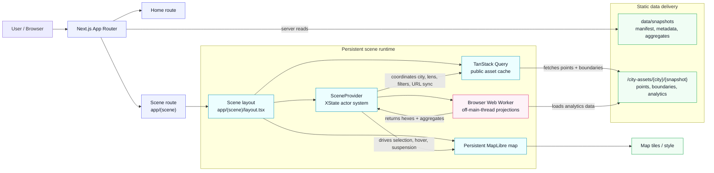

# Plainsight Case Study

## Thesis

Plainsight is a frontend-first geospatial analysis app designed around persistent map rendering, large client-side datasets, off-thread analysis, URL-restorable state, and deterministic orchestration.

The goal was not to build another mostly static portfolio app. I chose a map-based market explorer because it creates real frontend complexity: an expensive client-only map, large local datasets, asynchronous computation, route transitions, restored interaction state, and dense responsive UI.

---

## 1. Overview

Plainsight is a public, read-only short-term-rental market explorer built on dated Inside Airbnb snapshots.

It helps a research-oriented user explore:

- where listings are concentrated
- what they cost
- how prices vary by area
- how the market is distributed by room type
- which hosts control larger portions of the market
- which individual public listings sit behind the aggregate patterns

The app currently supports four curated markets:

- London
- Berlin
- Manchester
- Amsterdam

Users can move between two lenses over the same map:

- **Analyse** — city-wide spatial patterns, H3 price hexes, KPIs, charts, and host structure
- **Browse** — individual public listings shown as map points and a virtualized list

Live demo: https://plainsight-theta.vercel.app/

---

## 2. Why I chose this problem

I chose this problem because it naturally exposes the kind of frontend engineering that is hard to demonstrate in a normal CRUD or mostly static application.

A short-term-rental map explorer is visual, data-heavy, interaction-heavy, and stateful. It has to coordinate:

- a client-only map that is expensive to mount
- city navigation without treating the map as a disposable page component
- large browser-side listing datasets
- fast filtering and aggregation
- worker replies that may arrive after the user has navigated away
- shared interaction state across map, list, charts, filters, and URL
- responsive UI that works as both a desktop panel and a mobile drawer
- accessible alternatives for workflows that should not depend only on map position or color

That made the project a good case study for frontend architecture, not just UI implementation.

The important part is that the architecture follows from the product shape. XState, Web Workers, persistent layouts, H3 aggregation, URL state, and data tiering are not included to make the stack look bigger. They address real constraints created by a map-first analytical interface.

---

## 3. Public demo scope

The public version of Plainsight is intentionally scoped as a read-only demo using curated dated snapshots.

This keeps the project:

- reproducible for reviewers
- understandable without accounts or setup
- suitable for low-cost public deployment
- legally and operationally simpler
- focused on frontend architecture rather than backend administration

Static snapshots are a demo boundary, not the only possible product direction.

A future version could allow users to import their own city datasets and reuse the same analysis architecture. That would require additional product and operational work: file validation, schema feedback, storage decisions, privacy rules, moderation boundaries, cost controls, and a practical way to test imported data quality.

For the portfolio demo, curated snapshots are the right boundary because they let the project focus on the frontend problems that matter most: map lifecycle, local data processing, state orchestration, accessibility, and reviewer confidence.

---

## 4. Core product constraints

Plainsight’s architecture is driven by the shape of the product, not by a desire to use more tools.

| Constraint                                        | Why it matters                                                                                                               |
| ------------------------------------------------- | ---------------------------------------------------------------------------------------------------------------------------- |
| The map is client-only and expensive              | The MapLibre instance should not be recreated on every city navigation. The app needs to feel like one continuous workspace. |
| The data is large enough to affect interaction    | Filtering and aggregation must not freeze the map, drawer, list, or controls.                                                |
| Analysis and browsing share the same selection    | Room filters, price filters, neighbourhood scope, map layers, charts, counts, and listings must agree.                       |
| Route changes create stale-state risks            | A worker result, map event, or selection from the previous city must not leak into the next city.                            |
| Exploration should be restorable                  | A user should be able to share or reopen the same lens, scope, filters, and selected listing.                                |
| The map is visual but cannot be the only workflow | Important meaning must also exist in text, controls, lists, summaries, and semantic UI.                                      |
| Public figures must be honest                     | The app must clearly present dated snapshot observations, not live availability, forecasts, or booking status.               |

---

## 5. Architecture response

Each major implementation choice exists because of one of those constraints.

| Product pressure                    | Architecture response                                                                                                 |
| ----------------------------------- | --------------------------------------------------------------------------------------------------------------------- |
| Expensive client-only map           | Keep the map mounted in a persistent scene layout above the city route segment.                                       |
| Large local data operations         | Move Analyse projections and aggregation into a Web Worker; serve Browse from prebuilt points cached by React Query.  |
| Spatial analysis over many listings | Precompute and project data into H3-based city hexes for the Analyse lens.                                            |
| Shared selection across surfaces    | Model selection as a single domain concept used by map, list, summaries, and URL state.                               |
| Route and data lifecycle races      | Use an XState actor system to coordinate navigation, city replacement, map interaction, UI state, and worker replies. |
| Shareable exploration               | Mirror settled lens, scope, filters, and selection into the URL.                                                      |
| Public demo constraints             | Use curated, dated, attributed Inside Airbnb snapshots as static frontend assets.                                     |
| Dense responsive UI                 | Use tokens, layout rhythm, semantic regions, and panel/drawer composition instead of ad-hoc layout decisions.         |
| Accessibility risk of map-first UI  | Treat the map as a powerful spatial layer, but keep key workflow meaning available through non-map UI.                |

The result is a frontend-owned scene subsystem: Next.js provides the static routes and data entry points, while the browser owns the interactive analytical workspace.

---

## 6. Deep dive: map lifecycle

The map is the most expensive part of the interface. It is client-only, owns an imperative MapLibre instance, loads external tiles, manages layers, and reacts to user interaction.

Treating it as a normal page component would create unnecessary remounts during city navigation. Instead, Plainsight keeps the map mounted in the scene layout while the city-specific panel and data change around it.

That creates a better user experience, but it also creates a correctness problem: during navigation, the old city may still be visible while the new city route and data are loading.

Plainsight handles that with an explicit suppression window:

- navigation intent starts before the new route fully settles
- map interaction is suspended while the city switch is in progress
- old hover/selection highlights are cleared
- incoming city data can still update the map
- interaction resumes only when the new city is ready or has failed safely

The goal is not to hide the transition. The goal is to prevent stale interaction: a user should not be able to click a London listing as if it belonged to Berlin during a city change.

---

## 7. Deep dive: state orchestration

Plainsight uses XState where the hard problem is lifecycle coordination.

The app has several moving parts with different lifetimes:

| Actor      | Lifetime      | Responsibility                                                               |
| ---------- | ------------- | ---------------------------------------------------------------------------- |
| root       | scene session | coordinates city replacement, suppression, resume, and URL sync              |
| navigation | scene session | tracks route intent and committed path changes                               |
| map        | scene session | owns MapLibre readiness and interaction gating                               |
| UI         | scene session | owns lens, hover, selection, and UI interaction state                        |
| worker     | scene session | routes shared worker load, hex, aggregate, and cancellation requests         |
| city       | per city      | owns the active city’s loading, analysis, browse state, and result freshness |

A simpler store can hold values, but the main problem here is not only storing values. It is deciding **when events are valid**, **which actor owns a lifecycle**, **what should be ignored during navigation**, and **how stale async results are prevented from affecting the current city**.

That is why the app uses event-driven orchestration:

- route changes produce navigation events
- navigation starts a suppression window
- city changes replace the city actor
- worker replies are reconciled against the active city
- map and UI resume only when the city is ready or has failed safely
- URL writes happen only after the selection settles

Zustand would be a reasonable choice for simpler local state. In Plainsight, the coordination problem became large enough that explicit states, transitions, guards, and actor lifetimes were more valuable than a store-only model.

---

## 8. Deep dive: data and performance

Plainsight uses dated public snapshots transformed into static application assets.

That keeps the public demo reproducible, but it also means the browser owns a meaningful part of the analytical workload. The app has to keep interaction responsive while filtering listings, computing summaries, projecting Browse results, and generating map-ready hexes.

The data/performance approach has several layers:

| Technique                | Purpose                                                             |
| ------------------------ | ------------------------------------------------------------------- |
| Preprocessed city assets | Avoid parsing and reshaping raw source data at runtime              |
| Snapshot tiers           | Load only the kind of data each surface needs                       |
| TanStack Query           | Cache city assets and make revisits faster                          |
| Web Worker               | Move expensive Analyse projections off the main thread              |
| H3 aggregation           | Represent city-wide spatial price patterns as inspectable hex cells |
| Virtualized list         | Browse large result sets without rendering every row at once        |
| URL selection model      | Reopen an exploration without recomputing unrelated state manually  |

The worker is important because the UI should stay responsive while analysis changes. Filtering a large city should not freeze the map, drawer, list, or controls.

The H3 layer is used for the Analyse lens because it gives a stable spatial grid for comparing city-wide price patterns. Browse uses individual listing points instead, because its job is inspection rather than aggregation.

---

## 9. Design system and accessibility

Plainsight is a dense visual interface, so the design system is not only decorative. It exists to keep the map, panels, controls, charts, lists, and overlays readable as one product.

The UI is built around:

| Design concern       | Approach                                                                          |
| -------------------- | --------------------------------------------------------------------------------- |
| Visual consistency   | Shared tokens for color, typography, radius, spacing, and elevation               |
| Layout rhythm        | Repeated spacing rules for panels, cards, control groups, and overlays            |
| Responsive structure | Desktop analysis panel becomes a mobile drawer without creating a second workflow |
| Theme support        | Dark and light themes update the UI and map styling together                      |
| Dense information    | KPIs, charts, filters, legends, and listing rows use consistent hierarchy         |
| Interaction clarity  | Hover, selection, loading, empty, and disabled states are represented explicitly  |

Accessibility is treated as part of the product architecture, especially because map-first interfaces can easily become visual-only experiences.

The goal is:

> The map should enhance spatial exploration, but it should not be the only way to understand or operate the app.

That means:

- core actions use semantic controls
- panels and drawers expose named regions
- filters and lens switching have keyboard paths
- important counts and selections are available as text
- color is not the only carrier of meaning
- loading and empty states are explicit
- listing inspection is available through the Browse list, not only map points

There is still work to do, especially around the map experience itself. The current direction is to make the non-map workflow complete enough that the map becomes a rich spatial enhancement rather than a hard accessibility blocker.

---

## 10. Testing and confidence

Plainsight’s tests are organized around the risks the app actually has.

| Risk                            | Confidence layer                                                                                           |
| ------------------------------- | ---------------------------------------------------------------------------------------------------------- |
| Pure data logic breaks          | Unit tests for filters, projections, sorting, search params, and geospatial helpers                        |
| State coordination regresses    | Machine tests for navigation, suppression, stale results, and actor transitions                            |
| Rendered behavior changes       | UI integration tests using user-visible queries                                                            |
| Accessibility semantics regress | axe checks and keyboard-focused interaction tests                                                          |
| Real browser workflows fail     | Playwright E2E tests for city selection, lens switching, filtering, Browse inspection, and URL restoration |
| Performance budgets drift       | Lighthouse/CI checks for selected routes and layout metrics                                                |
| Reviewer confidence drops       | CI runs formatting, linting, type checking, tests, build, E2E, and Lighthouse checks                       |

The goal is not coverage for its own sake. The goal is to protect the contracts most likely to break in a map-heavy, stateful, data-driven frontend.

---

## 11. Tradeoffs and limitations

Plainsight is intentionally scoped. The public demo does not try to solve every possible product direction.

| Limitation                           | Reason                                                                                                 |
| ------------------------------------ | ------------------------------------------------------------------------------------------------------ |
| Data is static, not live             | The public demo prioritizes reproducibility, attribution, and low-operational hosting.                 |
| No booking availability              | The source data does not provide a reliable live booking workflow, so the app does not invent one.     |
| No user-uploaded datasets            | Imports would require validation, storage, privacy rules, moderation, cost controls, and more testing. |
| Browser-side data has limits         | Large snapshots need careful tiering, caching, and worker boundaries.                                  |
| Map accessibility is difficult       | The map is being treated as an enhancement while non-map workflows continue to improve.                |
| No formal WCAG conformance claim yet | Automated checks help, but formal conformance requires manual evaluation across workflows and devices. |

The important tradeoff is that Plainsight is optimized as a public case study for frontend architecture, not as a full production SaaS product.

---

## 12. What this demonstrates

Plainsight demonstrates that I can design a frontend system around real product constraints rather than defaulting to framework patterns.

It shows experience with:

- geospatial interfaces and map rendering
- data-heavy browser applications
- frontend architecture and module boundaries
- event-driven state orchestration
- async lifecycle and stale-result protection
- Web Worker performance boundaries
- URL-restorable interaction state
- responsive UI composition
- accessibility-aware product design
- testing strategy and CI confidence

The project is intentionally frontend-first: the browser owns the interactive analytical workspace, while the public demo scope keeps the product reproducible, reviewable, and deployable without unnecessary backend complexity.
