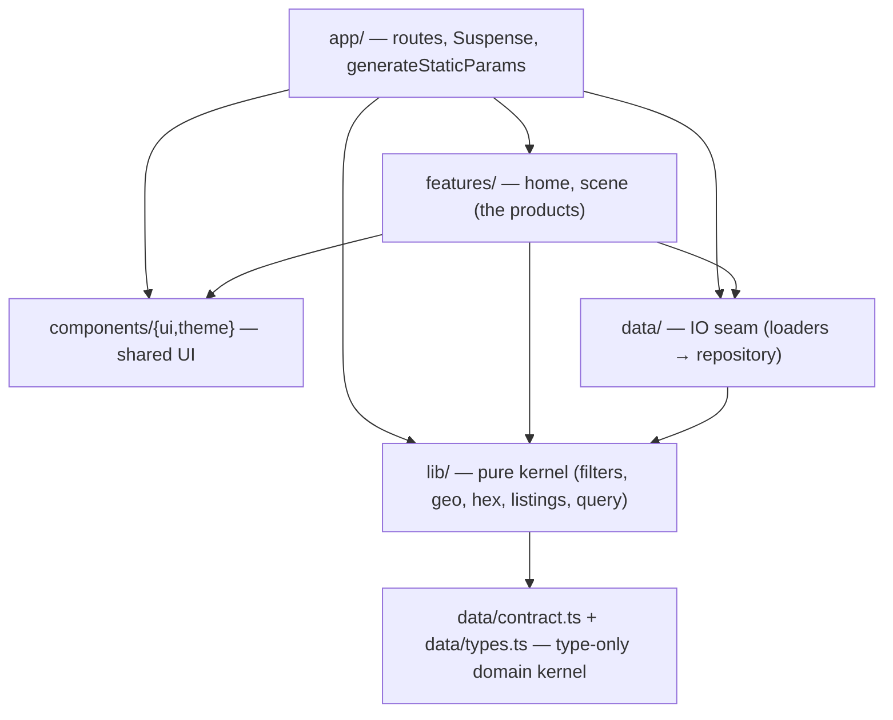
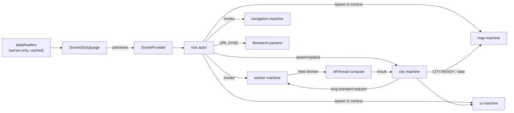
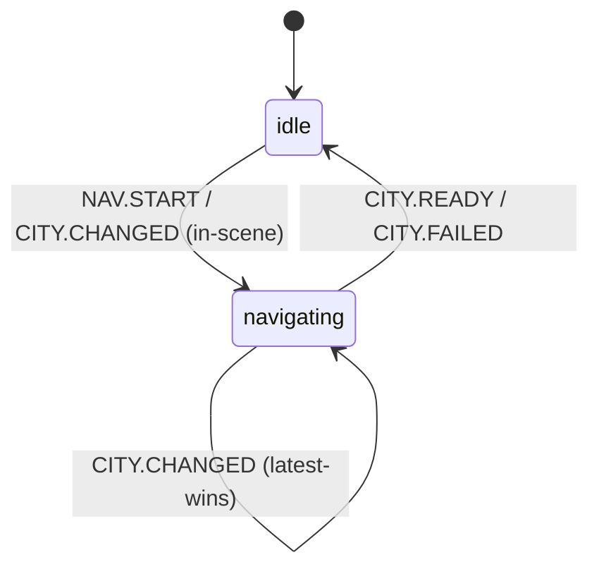
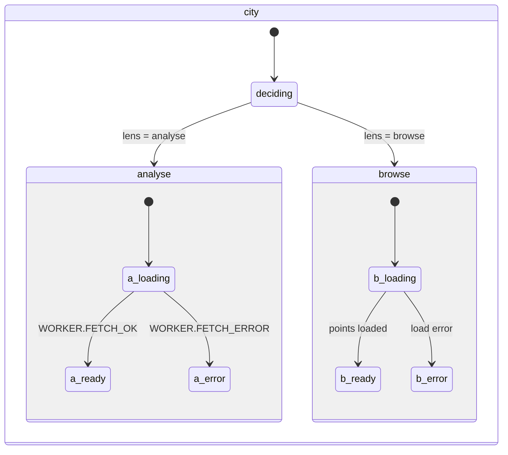
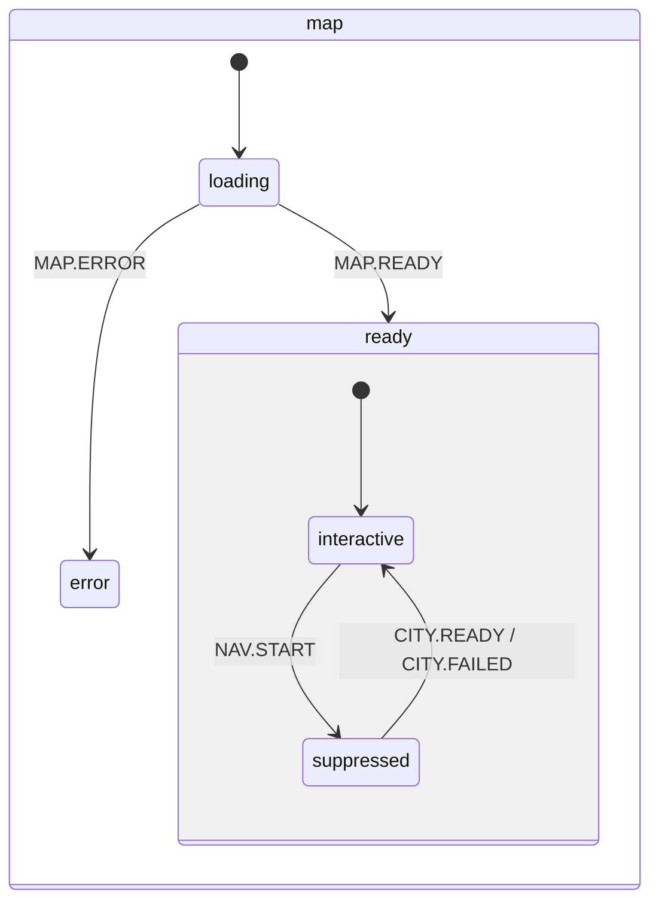

# Architecture

What Plainsight is, how it is layered, and how the runtime coordinates a map, a
worker, and the URL through one state machine system. This document describes the
system as it stands; `conventions.md` covers how to work inside it, and
`decisions/` records why the load-bearing choices were made.

## System Overview

Plainsight is a read-only short-term-rental market explorer. A user picks a
curated city, reads its dated market context, narrows the selection by room type,
price, or neighbourhood, and switches between two lenses over one map:

- **Analyse** (investor) — aggregate price/room-mix/host structure, a hex
  density layer, KPI and chart cards.
- **Browse** (renter) — the individual public listing records behind the
  aggregates, as map points and a scrollable list with detail.

It is a **Next.js 16 App Router** application with **Cache Components**
(`cacheComponents: true`) enabled. There is **no backend**: each city is an
immutable, dated Inside Airbnb snapshot served as static assets. Heavy
aggregation runs **off the main thread** in a Web Worker. The launch set is
London, Berlin, Manchester, and Amsterdam (September 2025).

## Module Boundaries

The codebase is layered; **dependencies point downward only**. A layer may import
from layers below it, never above. A feature never imports a sibling feature.



- **`app/`** — routes only. Composes features, owns `<Suspense>` placement and
  `generateStaticParams`; no data shaping, no business logic.
- **`features/`** — the product surfaces (`home`, `scene`). A feature owns its
  components, hooks, state, and view-models. It may import shared UI; it **must
  not** import a sibling feature or `app/`.
- **`components/`** — **shared, cross-feature UI only**: `ui/` (shadcn
  primitives), `theme/`, and chrome (`logo`). Single-consumer UI lives in its
  feature, not here.
- **`data/`** — the **only IO seam**. UI reaches data through the `@/data`
  loaders barrel; nothing outside `data/` may import `data/repository/*`. The
  type-only **domain kernel** (`data/contract.ts` + `data/types.ts`) is
  client-safe and sits logically below `lib`.
- **`lib/`** — the pure, framework-light kernel: geo math, filter/sort/normalize,
  the hex aggregation, the listings worker engine, the React Query client. A
  React hook, store, or component does not belong here.

The enforced detail (barrels, aliases, `server-only`/`use client` placement,
co-location rules) lives in `conventions.md` — ESLint owns the import/layer
gates. _Why this shape:_ one product, one IO seam, one reusable kernel; see
ADR [0001](decisions/0001-adopt-feature-based-architecture.md).

## Feature Anatomy

`features/scene` is decomposed into sub-domains plus `state/` (the actor system)
and `shared/` (cross-sub-domain hooks and utils). **No sub-domain imports
another sub-domain's internals** — shared code goes to `shared/`.

```text
features/scene/
  analysis/        KPI row, charts, filter-panel, data provenance (Analyse lens)
  browse/          listing list, cards, detail, gallery (Browse lens)
  map/             MapLibre canvas + layers/{hex,neighbourhoods,points} + hooks/
  city-switcher/   in-scene city change (server + client-link split)
  lens-switcher/   Analyse ⇄ Browse toggle
  state/           the XState actor system (machines/ + provider)
  shared/          format, room-display, use-lens, use-scope, city-asset-url, …
  scene-view.tsx · scene-panels.tsx · scene-drawer.tsx · scene-url-loader.tsx
  scene-meta-provider.tsx · scene-notifications.tsx · market-header.tsx
features/home/
  home-view.tsx · city-picker/ (cards, links, skeletons)
```

The **map persists across city navigation**: it is mounted in
`app/(scene)/layout.tsx` (above the `/[city]` segment), so switching cities swaps
only the per-city chrome that `SceneView` renders, never the map instance.

## Runtime And Data Flow

Server work is cached and request-API-free; the client owns interaction state.
The route stays **fully static** — no region reads `searchParams`; the URL is
reflected into the machine on the client.

1. **Server loaders** (`data/loaders.ts`, `server-only`, cached) shape snapshot
   reads into display models behind the `@/data` barrel. Pages pass **plain
   primitives** into client components — never promises threaded as data.
2. **`SceneProvider`** (`features/scene/state/provider.tsx`) mounts the root
   actor once and injects the runtime dependencies the machines stay free of —
   the `loadBrowsePoints` actor and `prefetchCity` action, both closured over the
   app React Query client — via `machine.provide()`.
3. **`SceneUrlLoader`** dispatches `CITY.CHANGED` on mount, spawning a fresh
   `city` actor seeded with the URL selection.
4. The **city** machine asks the shared **worker** to load and aggregate
   listings off-thread; results return slug-stamped and are reconciled into the
   map and UI imperative layers.
5. The settled selection is **mirrored back to the URL** via
   `lib/search-params` (gated to `idle`, so it never writes mid-navigation).



Data is split into tiers: server-rendered tiers (meta, aggregates) are cached and
traced for the function (`outputFileTracingIncludes`); browser-facing immutable
tiers (`city-assets`, boundaries, analytics) are served from static storage with
`immutable` cache headers and primed via React Query prefetch. City snapshots are
immutable and dated — see ADR
[0003](decisions/0003-use-immutable-city-snapshots.md).

## State Management — The Actor System

One **XState v5** actor system owns scene orchestration. It replaced an
earlier Zustand store once the problem became _coordinating work_ (map readiness,
city-switch windows, stale worker replies) rather than storing values — see ADR
[0002](decisions/0002-use-xstate-for-scene-orchestration.md). Actors find each
other through the receptionist (`system.get(SystemId.*)`); lifetime dictates the
mechanism:

| Machine        | Lifetime | Mechanism               | Owns                                                 |
| -------------- | -------- | ----------------------- | ---------------------------------------------------- |
| **root**       | session  | —                       | the navigation gate + the single `NAV.START` fan-out |
| **map**        | session  | spawned in root context | the MapLibre instance lifecycle + interaction gating |
| **ui**         | session  | spawned in root context | lens, selection, hover                               |
| **worker**     | session  | invoked                 | the shared Web Worker + listings cache               |
| **navigation** | session  | invoked                 | path changes and in-scene navigation intent          |
| **city**       | per-city | spawned/replaced        | per-city load/aggregate, slug-stamped staleness      |

The **worker is shared across cities**, so its listings cache survives navigation
— revisiting a city is a cache hit, not a refetch. The **city** machine is
spawned fresh per navigation and stopped/replaced on the next one.

**The navigation gate.** `root.running` is refined into `idle ⇄ navigating` to own
the city-switch window. A switcher click (`NAV.START`) prefetches the slug, stamps
`pendingSlug`, and fans out to `map` and `ui` (their suppressed/navigating
states) — root is the only fan-out point. A route-initiated switch (browser
Back/Forward, no click) is recognized by `isInSceneCityChange` and synthesizes the
same fan-out, so every in-scene switch is gated alike. `CITY.READY` (or
`CITY.FAILED`) closes the gate.





The city machine sends **slug-stamped** requests to the shared worker and guards
every reply (`fetchIsCurrent` / `resultIsCurrent`): a reply addressed to a city
the user has since navigated away from is dropped. On convergence it notifies
root/map/ui (`CITY.READY`); on terminal failure it notifies them (`CITY.FAILED`)
and emits a semantic `city.error` that the notification layer turns into a toast —
the machine stays UI-agnostic and portable.

The **worker** machine is flat (no per-city states): the `city` machine owns
loading/ready/error. It invokes a session-lifetime `transport` actor that spawns
the Web Worker and routes load/process replies back by slot. The **ui** machine
mirrors the gate with `active ⇄ navigating`, dropping `UI.*` events during a
switch so stale selection/hover can't leak into the new city's first render.

## Map / Rendering Lifecycle

The **map** machine makes itself — not the view — the gatekeeper for interaction.
Its lifecycle tracks the MapLibre instance:



- **`ready.interactive`** accepts pointer interactions (`SELECT` / `HOVER` /
  `HEX_INSPECT`).
- **`ready.suppressed`** — a city change is in flight: pointer interactions are
  structurally absent (the machine, not the view, enforces the gate), and the old
  city's highlights are cleared on entry. The view derives the whole transition
  treatment from `ready.suppressed` — it blanks data layers, dims the basemap
  behind a scrim, shows a loader, and disables interaction.
- Events that bring the **new** city in (`FIT_BOUNDS`, `SOURCE_LOADED`,
  `RESOLUTION_CHANGED`) sit on the `ready` parent so they flow in **both**
  children — `suppressed` rejects interaction yet still ingests the incoming city.

**Readiness race.** A `FIT_BOUNDS` arriving while `loading` is coalesced into
`pendingFitBounds` (last-wins) and applied once on entry to `ready`, alongside
re-applying the current selection/hover from the `ui` actor — the imperative
layer is synced to durable truth structurally, not via effect replay gates.

The full gating contract — every transition, why each event sits where it does,
and the imperative-sync rules — lives in
[`../docs/map-machine-transition-gating.md`](../docs/map-machine-transition-gating.md).

## Related Documents

- [`conventions.md`](conventions.md) — folder structure, imports, component and
  token rules (how to work in the repo).
- [`testing.md`](testing.md) — test layers, machine/UI integration split,
  commands.
- [`project-boundaries.md`](project-boundaries.md) — requirements, constraints,
  non-goals.
- [`decisions/`](decisions/) — ADRs for the load-bearing choices.
- [`../docs/map-machine-transition-gating.md`](../docs/map-machine-transition-gating.md)
  — the deep map-machine gating reference.
