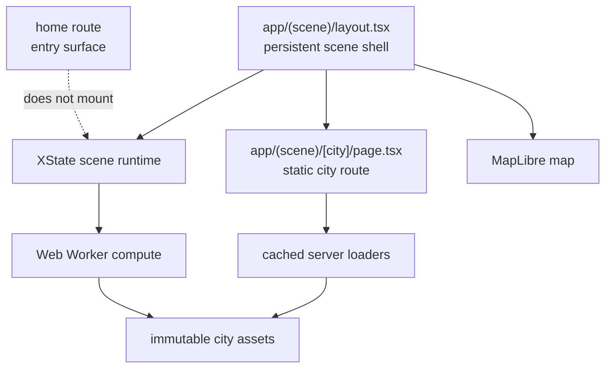
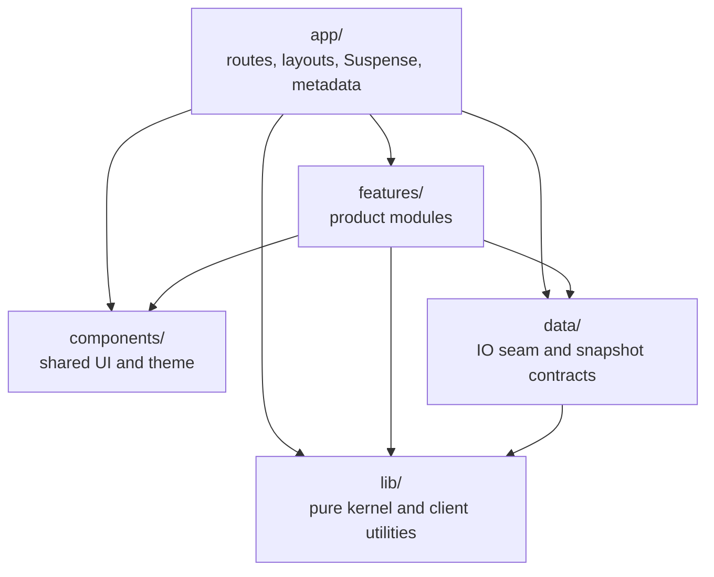
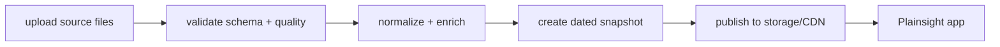
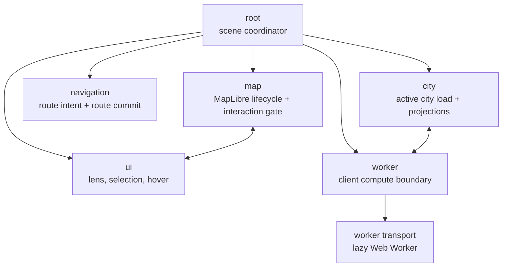
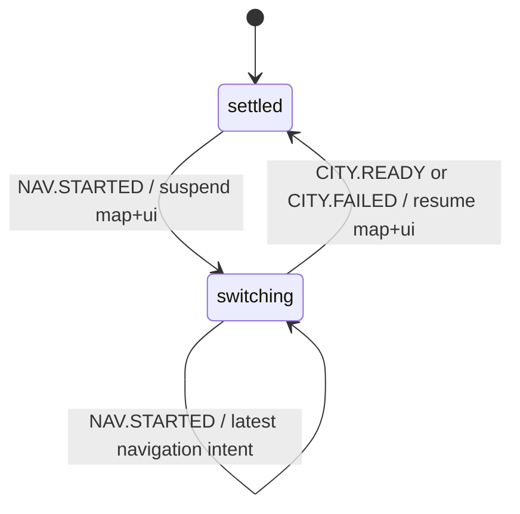

# Architecture

This document describes the current Plainsight implementation for developers,
reviewers, and future maintainers. It is not a product tutorial or selling page.
The source of truth is the implementation; comments and older docs should be
corrected when they drift.

`conventions.md` explains how to work inside the repository. `decisions/` records
why load-bearing architecture choices were made.

## Purpose

Plainsight is a city-scale geospatial exploration app for short-term rental
snapshots.

The core requirement is to inspect an entire city dataset spatially, derive
city/neighbourhood-level statistics, and move between aggregate map patterns and
individual listing details without server-side pagination.

That requirement drives the architecture:

- the active city snapshot is available on the frontend;
- the map renders the complete spatial layer for the active city;
- DOM-heavy listing UI is virtualized rather than fully mounted;
- filter-dependent city-scale projections run on the client, using a worker when
  the operation is too expensive for the main thread;
- the current version has no persistent application backend. It is backed by
  immutable snapshot assets and cached server loaders.

This is not a frontend-only framing forced onto a backend-shaped problem. For
this product shape, most request-time interactions operate over data that is
already required in the browser for map analysis. A production backend would
still exist, but its primary job would be snapshot ingestion and publishing:
upload, schema validation, normalization, quality checks, versioning, and
publishing assets to storage/CDN. Request-time API queries would be added only
when the product requirements justify them.

## System overview

Plainsight is a Next.js App Router application with Cache Components enabled.
The app is organized around a lightweight entry route and a scene route group.



The home route is an entry surface only. It intentionally does not mount the
scene runtime, XState actor system, MapLibre map, or scene React Query provider.
That keeps the first page lightweight and leaves room for a real-world project
or scenario picker that may stay mostly server-rendered.

The scene runtime starts only when the user enters the `(scene)` route group.
Inside that group, city-to-city navigation reuses the same scene shell and map
instance.

## Module boundaries

The codebase is layered. Dependencies point downward only. A layer may import
from layers below it, never above. A feature must not import a sibling feature.



- `app/` composes routes and layouts. It should not own data shaping or scene
  business logic.
- `features/` contains product modules. In practice, `home` is only an entry
  surface; `scene` owns the geospatial runtime.
- `components/` contains shared cross-feature UI only.
- `data/` is the IO seam: server loaders, snapshot contracts, and the repository
  boundary. UI code should reach data through public loaders/contracts, not
  repository internals.
- `lib/` contains pure or framework-light logic such as filters, URL state,
  geometry helpers, listing derivation, formatting, and client infrastructure.

The enforced import rules, barrel rules, server/client placement, and comment
rules live in [`conventions.md`](conventions.md). ADR
[0001](decisions/0001-adopt-feature-based-architecture.md) records the
feature-based architecture decision.

## Scene domains

The scene is documented as interacting domains, not as a page/component tree.
Pages and layouts compose the domains; they do not own the scene logic.

```text
features/scene/
  analysis/        Analyse lens: KPIs, charts, filter panel, hex/aggregate view
  browse/          Browse lens: listing list, cards, detail, gallery
  map/             MapLibre canvas, layers, map hooks, spatial interaction
  city-switcher/   in-scene city changes and navigation intent
  lens-switcher/   Analyse/Browse toggle
  state/           XState actor system and provider
  shared/          shared scene utilities and hooks
```

Primary domain interactions:

- Browse selection updates map feature state.
- Map hover can drive Browse list scroll.
- Analyse filters trigger city/worker recomputation.
- City navigation suppresses map and UI until the new city is ready or failed.
- URL hydration seeds semantic scene state.
- Server loaders and public asset URLs provide immutable snapshot inputs.

## Persistent scene layout

`app/(scene)/layout.tsx` owns the persistent scene shell: the scene React Query
provider, the XState `SceneProvider`, scene notifications, and the persistent
map view.

The scene runtime persists across city-to-city navigation because the layout is
above the `[city]` segment. It is intentionally torn down when the user leaves
the scene route group.

This boundary is intentional for two reasons:

1. The home route should not pay for XState, MapLibre, scene React Query, or
   scene-specific client code when none of that is needed.
2. In a real application, the entry route might be a project/scenario table,
   upload flow, or dashboard that does not need map state or client-side scene
   transitions at all.

So the rule is:

> Scene state is persistent inside the geospatial scene module, not globally
> persistent across the whole website.

## Data architecture

Plainsight has no persistent application backend in the current version. It is a
snapshot-backed app:

- server-rendered tiers are read by cached `server-only` loaders;
- larger interactive tiers are served as immutable public city assets;
- client-side React Query and the worker load interactive assets when the scene
  needs them;
- city snapshots are immutable and dated.

The important distinction is data availability versus rendering.

The active city dataset is available on the frontend because city-level map
analysis and statistics require the full unpaginated population. That does not
mean React renders every listing. The map renders the spatial dataset through
MapLibre/WebGL layers, while DOM-heavy surfaces such as the Browse listing list
are virtualized.

A production system would add a data pipeline around these snapshots:



Backend computation would be reserved for fixed precomputed KPIs,
cross-snapshot/global metrics, validation/publishing work, or long-running
calculations that exceed the browser/worker budget. Filter-dependent projections
that operate on the already-loaded active city snapshot are kept on the client
when that is cheaper and sufficiently fast.

ADR [0003](decisions/0003-use-immutable-city-snapshots.md) records the immutable
snapshot decision.

## Runtime architecture

One XState actor system owns scene orchestration. XState is used because the
hard problem is coordinating work across navigation, map readiness, UI state,
worker replies, stale results, and failure recovery. It is not used for every
local value in the application.

ADR [0002](decisions/0002-use-xstate-for-scene-orchestration.md) records the
state-orchestration decision.



### Actor creation rules

Actor creation is chosen by availability and lifetime, not by importance.

The default rule is to invoke stable child machines from the root. Use `spawn`
when an actor ref must be synchronously available before render, or when the
actor has dynamic entity/route lifetime.

| Machine      | Creation                 | Lifetime      | Reason                                                                          |
| ------------ | ------------------------ | ------------- | ------------------------------------------------------------------------------- |
| `root`       | provider actor           | scene session | coordinates the scene runtime                                                   |
| `map`        | spawned in root context  | scene session | React selectors need the actor ref synchronously before render                  |
| `ui`         | spawned in root context  | scene session | React selectors need the actor ref synchronously before render                  |
| `worker`     | invoked by root          | scene session | shared compute boundary; ref is not required synchronously for first render     |
| `navigation` | invoked by root          | scene session | tracks route intent/commit; ref is not required synchronously for first render  |
| `city`       | spawned/replaced by root | active city   | city data and lifecycle are route-scoped and should be discarded on city change |

### Root coordinator

The root machine should be described by role first, implementation state names
second.

Role:

> Root is the scene coordinator. It owns the city-switch window, replaces the
> active city actor, suppresses map/UI during navigation, resumes them when the
> new city is ready or failed, and gates URL writes so transition-time clears do
> not corrupt the URL.

Implementation:

- `NAV.STARTED` moves root from `settled` to `switching` and sends `SUSPEND` to
  map and UI.
- `CITY.READY` or `CITY.FAILED` returns root to `settled` and sends `RESUME` to
  map and UI.
- `URL.SYNC` writes only while root is `settled`.
- `CITY.CHANGED` stops the old city actor, cancels worker work, and spawns the
  new city actor.



## Runtime flows

### Initial scene entry

1. The static city page resolves city metadata through server loaders.
2. `SceneView` renders the scene panels and mounts `SceneUrlLoader`.
3. `SceneUrlLoader` reads `window.location.search` on the client.
4. It seeds lens/filter/scope/selection state and dispatches `CITY.CHANGED`.
5. Root spawns the active city actor with the selected city framing and initial
   filters.

### City navigation

1. A city link sends navigation intent.
2. The navigation actor reports `NAV.STARTED` to root.
3. Root enters the switching window and suppresses map/UI.
4. The route commits through `usePathname` and the route listener.
5. The old city actor is stopped and its worker work is cancelled.
6. A new city actor is spawned for the committed city.
7. `CITY.READY` or `CITY.FAILED` closes the switching window and resumes map/UI.

### Filter recomputation

1. UI/domain events update city filter context.
2. Cheap derivations can stay on the main thread.
3. City-scale filter-dependent projections are sent to the worker.
4. The worker coalesces/cancels in-flight work by process slot and request id.
5. Current results are accepted by the active city actor; stale results are
   dropped.

### Map and Browse interaction

- The map renders the complete spatial layer for the active city.
- The Browse list represents the current filtered/sorted result set but mounts
  only visible rows through virtualization.
- Hover and selection are shared scene interactions, coordinated through the UI
  and map actors.
- Listing selection belongs to the Browse lens. Analyse does not own listing
  detail selection.

## URL state

The URL stores semantic scene state: state that defines what the user is looking
at and should survive refresh, sharing, and browser navigation.

URL-backed state:

- `lens` — Analyse or Browse;
- neighbourhood/scope;
- room-type filter;
- price filter;
- selected listing, but only for the Browse lens.

Runtime-only state:

- map camera and zoom;
- hover state;
- map source readiness;
- worker status;
- transition suppression state;
- MapLibre instance state.

The map is bounded to the active city geometry, so camera movement is local
navigation inside the already-selected city. It is not part of the shareable
scene identity.

The route remains static: pages do not read `searchParams` to drive rendering.
URL hydration happens on the client through `SceneUrlLoader`; URL writes are
mirrored back through the root machine only after the scene is settled.

Invariant:

> `listing` is Browse-only semantic state. If the active lens is Analyse, a
> listing id from the URL should be ignored or normalized away.

## Runtime safety

Runtime safety is documented as one concern because navigation, worker replies,
map readiness, and failures can happen out of order.

### Navigation safety

Navigation opens a switching window. During that window:

- root suppresses map and UI;
- map clears interaction state and disables interaction;
- UI drops stale interaction events;
- URL writes are gated;
- city replacement is latest-wins.

### Stale async result handling

The worker is shared across the scene session, while `city` is route-scoped.
That means replies can arrive after the user has moved to another city.

The runtime protects against this with two layers:

- worker request ids and cancellation/coalescing per process slot;
- city-level guards that check the active city identity, including slug and
  snapshot id.

Outdated load/process replies are dropped instead of being reconciled into the
new city.

### Failure recovery

Terminal city failures notify root through `CITY.FAILED`, so map/UI resume even
when the new city fails to load. The failure is surfaced semantically through the
notification layer instead of coupling machines directly to toast UI.

Worker fatal errors are routed through the worker actor and reported to the
active city/runtime boundary.

## Rendering model

The rendering model separates spatial rendering from React DOM rendering.

- MapLibre/WebGL renders the complete spatial layer for the active city.
- React renders panels, controls, details, and virtualized list rows.
- The listing list is virtualized over the filtered/sorted set so the dataset can
  be available without mounting thousands of DOM nodes.
- The map is mounted once per scene session and persists across city-to-city
  navigation.

The map machine owns MapLibre lifecycle and interaction gating. It uses parallel
regions for map lifecycle and interaction suppression, so a city transition can
suppress interaction even if the map lifecycle is loading/ready/error.

## Diagrams and state exploration

The architecture docs should keep diagrams small and concern-specific.

Recommended diagrams in docs:

- system structure;
- scene actor topology;
- important runtime sequences such as city navigation, filter recomputation, URL
  hydration/write sync, and stale worker result handling.

State-machine diagrams should be explored/generated from the XState machines via
Stately/XState tooling rather than manually maintained as large Mermaid copies.
The machines worth inspecting visually are:

- root;
- city;
- map;
- UI;
- worker;
- navigation.

This avoids duplicating transition logic in prose and prevents the docs from
becoming a second, stale implementation.

## Related decisions

Accepted ADRs:

- [0001 — Adopt feature-based architecture](decisions/0001-adopt-feature-based-architecture.md)
- [0002 — Use XState for scene orchestration](decisions/0002-use-xstate-for-scene-orchestration.md)
- [0003 — Use immutable city snapshots](decisions/0003-use-immutable-city-snapshots.md)

Planned or worth documenting as future ADRs:

- snapshot tiering between server-rendered metadata and public interactive
  assets;
- worker computation as the client-side compute boundary;
- persistent scene layout inside `app/(scene)/layout.tsx`;
- URL state semantics and browse-only listing selection.

## Related documents

- [`conventions.md`](conventions.md) — repository conventions, import rules,
  server/client placement, comments, and barrels.
- [`testing.md`](testing.md) — test layers and commands.
- [`project-boundaries.md`](project-boundaries.md) — product constraints,
  requirements, and non-goals.
- [`decisions/`](decisions/) — accepted architecture decisions.
