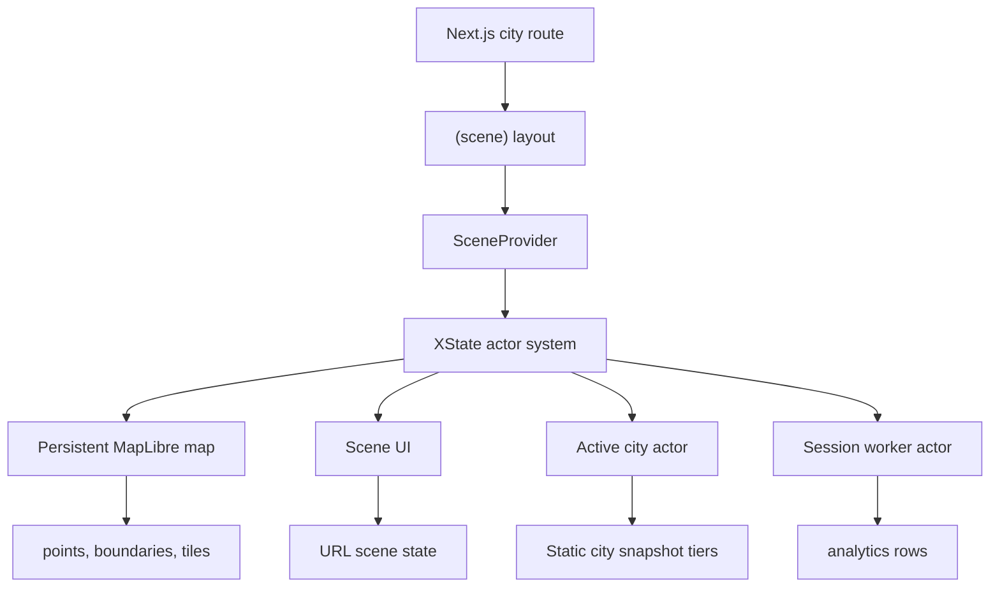

# Architecture

This document explains the current engineering shape of Plainsight.

It is an implementation-facing overview for contributors, reviewers, and future
maintainers. It does not repeat product requirements, testing policy, or full
ADR rationale.

Read this with:

- [Project boundaries](project-boundaries.md) for product scope and constraints.
- [Runtime orchestration](runtime-orchestration.md) for actor diagrams and
  runtime sequences.
- [Architecture decisions](decisions/README.md) for why load-bearing choices were
  made.

The implementation is the source of truth. If this document conflicts with code,
fix the document or the implementation in the same change.

## System overview

Plainsight is a frontend-first geospatial analysis app.

The public version uses immutable Inside Airbnb snapshots that are transformed
into static application assets. Next.js renders stable city routes and small
materialized summaries. The browser owns the interactive scene: persistent map,
XState actor system, filters, Browse list, Analyse recomputation, and URL state.



Core runtime idea:

> The route changes, but the scene session persists. The active city actor is
> replaced while the expensive map, UI actor, worker actor, and query cache stay
> alive for the scene route group.

## Module boundaries

```text
app/
  Next.js routes, layouts, metadata, server/client composition boundaries

features/
  product features and scene sub-domains

data/
  server-facing snapshot access, contracts, and typed loaders

lib/
  pure reusable logic and browser/server-safe calculation modules

docs/
  engineering docs and ADRs
```

Rules:

- `app/` composes routes and layouts. It should not own domain algorithms.
- `features/scene/` owns the map scene, Browse, Analyse, and actor system.
- `data/` owns snapshot loading and server-facing read models.
- `lib/` owns pure logic such as filters, listings projections, search params,
  and geo helpers.
- Shared UI primitives stay in `components/ui/`.
- Import boundaries are described in [Conventions](conventions.md) and enforced
  by ESLint where practical.

## Scene domains

The scene feature is split by runtime responsibility:

| Domain      | Owns                                                                  |
| ----------- | --------------------------------------------------------------------- |
| `analysis/` | Analyse panels, summaries, charts, aggregate presentation             |
| `browse/`   | Browse list, listing rows, selection drawer, browse-specific controls |
| `map/`      | Map shell, MapLibre canvas, layers, legends, map event wiring         |
| `state/`    | XState machines, actor provider, actor hooks, event contracts         |
| `shared/`   | Cross-scene utilities, shared view helpers, shared scene UI pieces    |

No scene sub-domain should import another sub-domain's internals. Shared code
moves to `shared/`, `state/`, `lib/`, or `components/ui/` depending on ownership.

## Persistent scene layout

The map lives in the `(scene)` route group layout, above the city route segment.
That layout owns the scene session: query provider, scene actor provider,
notifications, and `MapView`.

City pages provide city-specific server data and panel content, but they do not
own the MapLibre instance. This keeps city navigation from destroying and
recreating the expensive map runtime.

The decision is recorded in
[ADR 0004](decisions/0004-persist-scene-runtime-in-route-group.md).

## Data architecture

Plainsight uses snapshot tiers rather than a live database.

| Tier                    | Used by            | Purpose                                          |
| ----------------------- | ------------------ | ------------------------------------------------ |
| city manifest           | server/build       | enabled city list and asset metadata             |
| city metadata           | server/RSC         | city framing, labels, snapshot dates, price caps |
| materialized aggregates | server/RSC         | page-start KPIs and city/neighbourhood summaries |
| boundaries              | browser/map        | neighbourhood outlines and labels                |
| points                  | browser/map/Browse | one feature per listing for map dots and Browse  |
| analytics rows          | browser worker     | recompute Analyse aggregates and H3 cells        |

Server-facing tiers are small and cacheable. Browser-facing tiers can be larger
and are fetched by the client only when needed.

The immutable snapshot decision is recorded in
[ADR 0003](decisions/0003-use-immutable-city-snapshots.md). Snapshot tiering is
recorded in
[ADR 0006](decisions/0006-tier-city-snapshots-and-share-calculation-core.md).

### Calculation integrity

Snapshot materialization and runtime recomputation share the same calculation
core.

The offline aggregate generator, client worker, and main-thread Browse
projections use pure listing/filter projection modules. Server/RSC code does not
reimplement those calculations at request time. It reads committed materialized
aggregate tiers and selects from them directly.

This protects three user-visible surfaces from drifting:

- page-start KPIs from materialized aggregates;
- Analyse worker recomputation for filters, scope, and H3 cells;
- Browse filtering and sorting over the listing point tier.

Generator tests rebuild materialized aggregate output from analytics rows and
compare it with the committed snapshot output.

## Runtime architecture

The scene runtime is an XState actor system. XState is used for orchestration,
not for every local UI value.

| Actor        | Lifetime      | Owns                                                             |
| ------------ | ------------- | ---------------------------------------------------------------- |
| `root`       | scene session | city replacement, suppression window, URL write gate             |
| `navigation` | scene session | route intent and route commit                                    |
| `map`        | scene session | MapLibre lifecycle, feature-state painting, map interaction gate |
| `ui`         | scene session | lens, hover, selected listing, navigation-time UI drop window    |
| `worker`     | scene session | dataset lifecycle, calculation mode, request coalescing/cache    |
| `city`       | active city   | current city filter, lens leg, load status, stale-result guards  |

Root spawns session actors that React needs synchronously and invokes session
services that run for the scene lifetime. Root also spawns and replaces the
current city actor when the city changes.

Detailed actor diagrams and runtime sequences live in
[Runtime orchestration](runtime-orchestration.md). The XState decision is
recorded in
[ADR 0002](decisions/0002-use-xstate-for-scene-orchestration.md).

## State ownership

| State                                 | Owner                                                |
| ------------------------------------- | ---------------------------------------------------- |
| active city slug and snapshot framing | city actor input/context                             |
| current lens                          | UI actor, forwarded to city                          |
| filters and neighbourhood scope       | city actor                                           |
| selected listing and hover            | UI actor, mirrored to map for feature-state painting |
| MapLibre readiness and loaded sources | map actor                                            |
| worker request ids and process slots  | worker actor                                         |
| query cache for public assets         | TanStack Query                                       |
| URL serialization                     | root action reading live UI/city snapshots           |

Local component-only state should remain local. Server/cache data should remain
in Next.js or TanStack Query. Actors own lifecycle coordination and race-prone
cross-domain state.

## URL state

The URL stores semantic scene state, not low-level map runtime state.

URL-backed:

- lens;
- neighbourhood scope;
- room-type filter;
- price filter;
- selected listing in Browse.

Runtime-only:

- map camera and zoom;
- hover;
- MapLibre readiness;
- loaded source flags;
- worker request status;
- navigation suppression;
- transient loading and error details.

`SceneUrlLoader` is the URL-to-state entry point. `UrlWriteSync` observes
semantic scene state and asks root to sync. Root writes only while `settled` and
drops `URL.SYNC` while switching cities.

The URL decision is recorded in
[ADR 0007](decisions/0007-treat-url-params-as-client-scene-state.md).

## Runtime safety

The actor system protects these failure-prone edges:

- navigation starts before route commit;
- stale UI events from the previous city arrive during a switch;
- worker replies arrive after cancellation or after city replacement;
- MapLibre source data reloads and clears feature-state;
- URL writes happen while city-switch defaults are being cleared;
- Analyse recomputation fails while the last good result is still visible.

Safety rules:

- root suppresses map/UI on `NAV.STARTED` and resumes on `CITY.READY` or
  `CITY.FAILED`;
- identity-aware worker loads replace active data without cancelling a matching
  destination prefetch;
- the worker starts suspended, retains Analyse calculation intent until data is
  loaded, and permits one in-flight request per process type;
- worker process slots use deterministic request IDs to coalesce requests,
  cache completed results, and drop stale replies;
- city validates slug and snapshot id before accepting worker results;
- UI structurally drops interaction events while navigating;
- map interaction has its own suspended state independent of map loading.

## Rendering model

The app keeps the map and analytical UI decoupled:

- Map rendering is a client-only enhancement around MapLibre.
- Server Components provide stable route structure and page-start snapshot data.
- Browse can expose listing evidence without depending on map interaction.
- Analyse uses map layers for spatial meaning and panels/charts for textual
  meaning.
- The map is important, but non-map workflows must still expose counts, filters,
  selections, loading state, and errors through semantic UI.

## Documentation maintenance

When changing architecture, update only the canonical docs:

- structure or ownership changes: this file;
- runtime event flow/state diagrams: `runtime-orchestration.md`;
- why a load-bearing choice changed: a new ADR or an updated ADR;
- product scope/requirements: `project-boundaries.md`;
- test expectations: `testing.md`;
- contributor rules: `conventions.md`.

## Related documents

- [Project boundaries](project-boundaries.md)
- [Runtime orchestration](runtime-orchestration.md)
- [Testing strategy](testing.md)
- [Conventions](conventions.md)
- [Architecture decisions](decisions/README.md)
