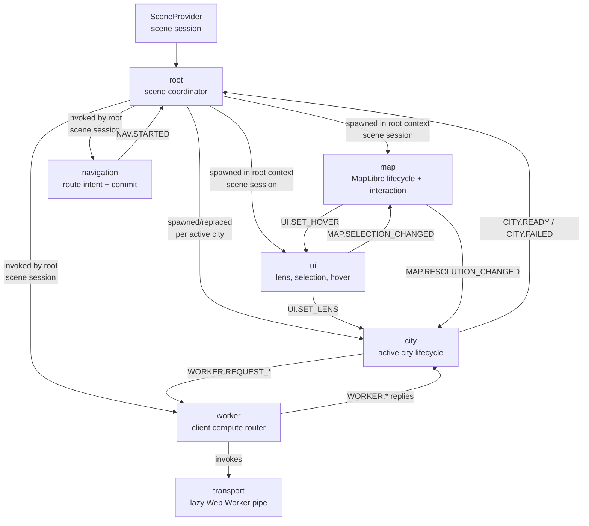
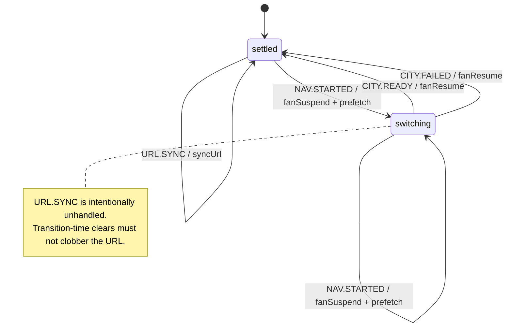
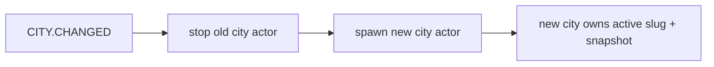
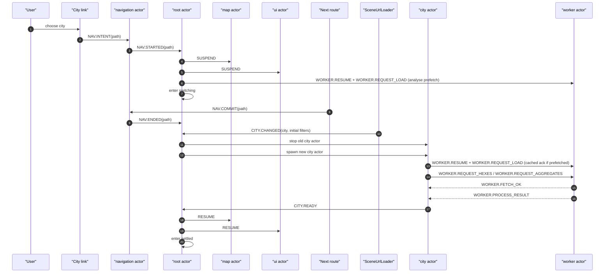
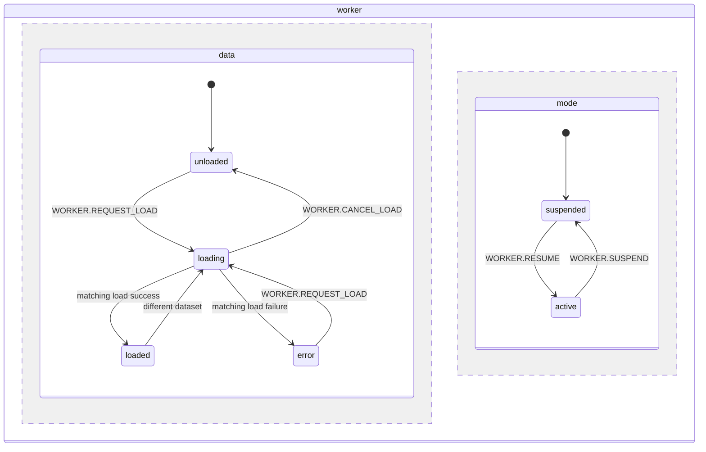
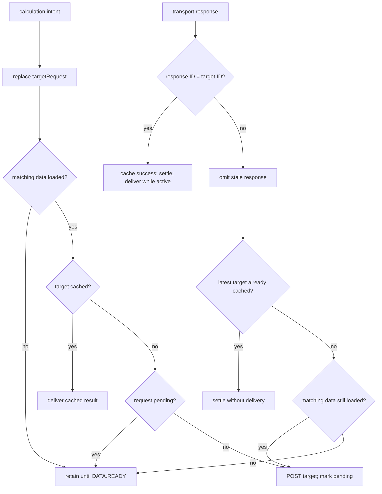

# Runtime Orchestration

This document contains actor diagrams and runtime sequences for Plainsight.

It does not replace [Architecture](architecture.md). Architecture explains the
system shape. This file shows how the scene actor system moves at runtime.

Keep this file diagram-first and prose-light. The implementation is the source
of truth.

## Diagram scope

Current diagrams:

1. actor topology;
2. root coordinator state diagram;
3. city navigation sequence.

Add more diagrams only when a runtime interaction is hard to understand from the
architecture overview and ADRs. Do not add one diagram per machine by default.

## Actor topology



## Root coordinator

Root owns the city-switch window.



City replacement is an action-level flow, not a separate root state:



The shared worker is not cancelled on replacement: the new city's
identity-aware `WORKER.REQUEST_LOAD` replaces old data only when the dataset
differs (and is acknowledged from cache when it matches a destination prefetch),
while any stale recompute response is rejected by request + snapshot identity.

## City navigation sequence



Safety properties:

- map and UI interaction are suppressed before the destination city is ready;
- a replaced city's stale worker work is rejected by request + snapshot identity,
  and a matching destination load is reused rather than cancelled;
- the switching window closes on either `CITY.READY` or `CITY.FAILED`;
- root drops URL writes while switching.

## Worker coordination

The worker machine is a scene-session actor. It owns analytics-data lifecycle,
calculation coordination, and the transport actor that communicates with the
Web Worker. Its `data` and `mode` regions are independent:



Initial state is `data.unloaded + mode.suspended`. Loading is independent of
mode, so Analyse navigation may prefetch a destination dataset before its city
actor exists. The transport creates the Web Worker lazily on its first command
and releases a failed thread so a later load can recreate it.

### Data lifecycle

- `WORKER.REQUEST_LOAD` from `unloaded` or `error` records the requested
  slug/snapshot and starts transport loading.
- An identical request in `loading` is deduplicated. A different request
  cancels the old transport load, resets slot targets/pending flags while
  preserving completed caches, and loads the new dataset.
- `WORKER.CANCEL_LOAD` applies only in `loading`; there is no unload event and no
  combined worker-cancel event.
- Only a load response matching the requested slug/snapshot can enter `loaded`
  or `error`. Other load responses are omitted.
- A matching success records the loaded identity, sends `WORKER.FETCH_OK`, and
  raises internal `DATA.READY`. `WORKER.FETCH_OK` contains only slug and snapshot
  ID.
- An identical load request in `loaded` immediately acknowledges the current
  city without a transport round-trip. This is how city replacement reuses a
  completed destination prefetch.
- A load or transport failure enters `error`, clears pending flags, and preserves
  calculation targets and completed caches for retry.

### Calculation slots

Hexes and aggregates each own one bounded slot:

```text
targetRequest  latest deterministic request for this process type
isPending      whether one transport calculation is outstanding
lastCompleted  latest successful request ID and result
```

The request ID is deterministic over process type, slug, snapshot ID, and
normalized calculation parameters. It is both the deduplication key and the
response identity.



While active, calculation intent received before `data.loaded` is retained and
dispatched on `DATA.READY`. At most one transport calculation per process type
is outstanding; newer intent replaces the target rather than adding synchronous
worker work to a queue. A current success is cached and delivered, while a
current failure is delivered without discarding the last successful result. A
superseded response is omitted and only the latest uncached target is posted.

While suspended, new calculation requests are omitted. In-flight responses are
still settled and successful responses are cached, but nothing is delivered and
no replacement calculation is posted. Suspension never clears slot state.
Resuming changes mode only; the Analyse city leg sends current calculation
intent again, allowing cache delivery or a fresh request.

### Consumer sequence

Analyse entry sends:

```text
WORKER.RESUME
WORKER.REQUEST_LOAD
WORKER.REQUEST_HEXES
WORKER.REQUEST_AGGREGATES
```

The calculation requests are sent immediately rather than waiting for city or
map readiness. Browse entry sends `WORKER.SUSPEND` and no calculation requests.
Root city replacement does not cancel the shared worker; the new city's
identity-aware load either replaces old data or reuses the matching prefetch.
The city actor independently checks slug and snapshot identity before accepting
worker replies.

## Future diagram candidates

Add these only if the implementation becomes hard to follow without them:

- map parallel lifecycle/interaction state diagram;
- URL hydration/write-sync sequence;
- Analyse recomputation sequence.

If added, each diagram should stay focused on one concern and use real event
names from the machines.
