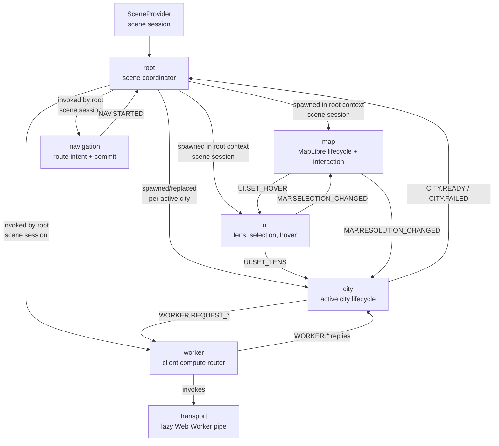
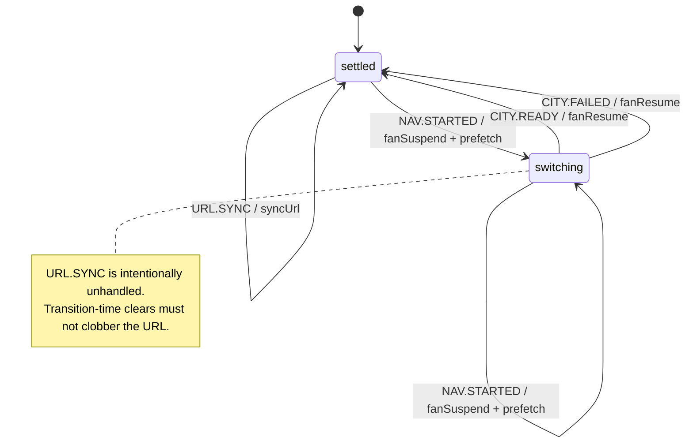
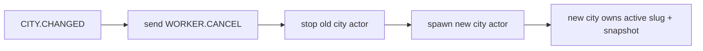
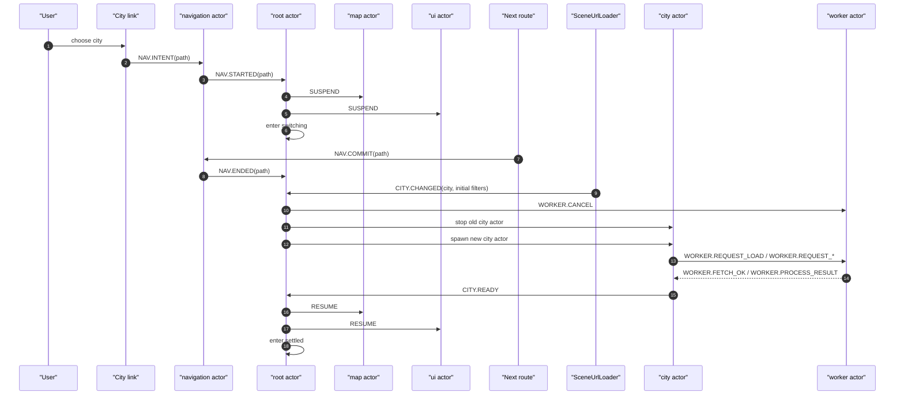

# Runtime Orchestration

This document contains actor diagrams and runtime sequences for Plainsight.

It does not replace [Architecture](architecture.md). Architecture explains the
system shape. This file shows how the scene actor system moves at runtime.

Keep this file diagram-first and prose-light. The implementation is the source
of truth.

## Diagram scope

Current diagrams:

1. actor topology;
2. root coordinator state diagram;
3. city navigation sequence.

Add more diagrams only when a runtime interaction is hard to understand from the
architecture overview and ADRs. Do not add one diagram per machine by default.

## Actor topology

## Root coordinator

Root owns the city-switch window.

City replacement is an action-level flow, not a separate root state:

## City navigation sequence

Safety properties:

- map and UI interaction are suppressed before the destination city is ready;
- old worker work is cancelled when the city actor is replaced;
- the switching window closes on either `CITY.READY` or `CITY.FAILED`;
- root drops URL writes while switching.

## Future diagram candidates

Add these only if the implementation becomes hard to follow without them:

- map parallel lifecycle/interaction state diagram;
- worker process-slot diagram;
- URL hydration/write-sync sequence;
- Analyse recomputation sequence.

If added, each diagram should stay focused on one concern and use real event
names from the machines.
