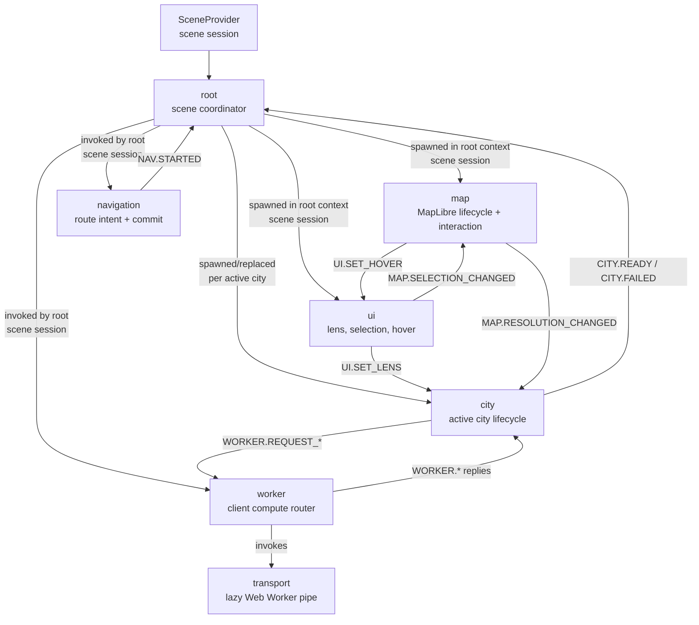
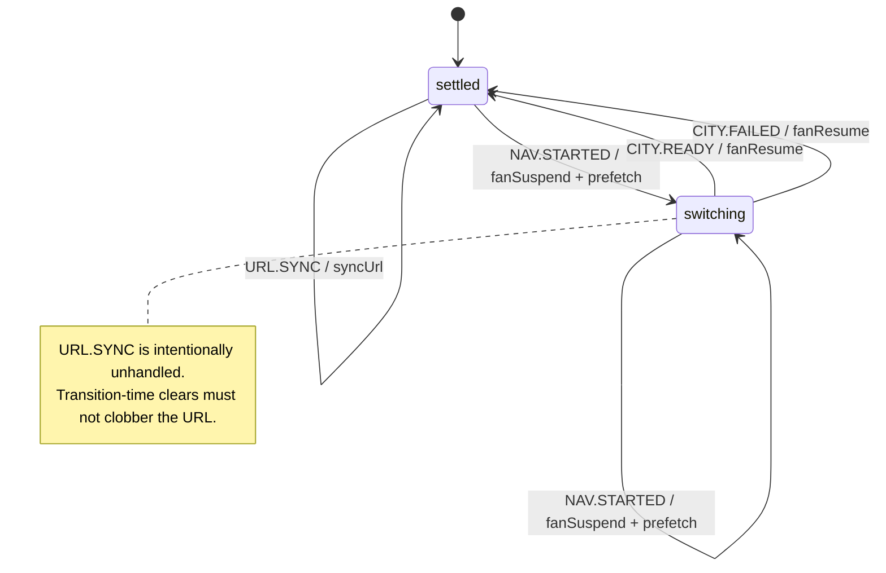
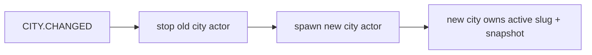
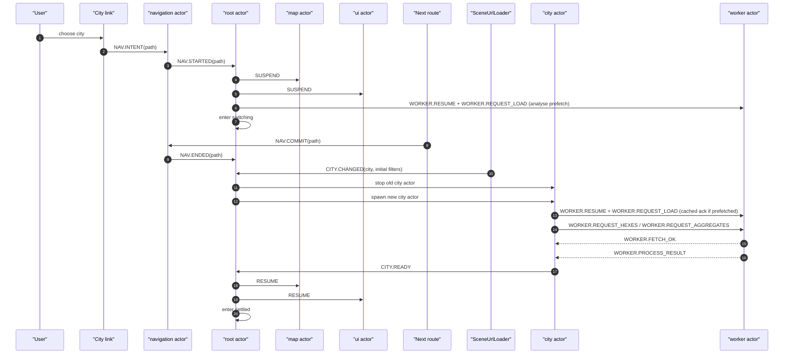
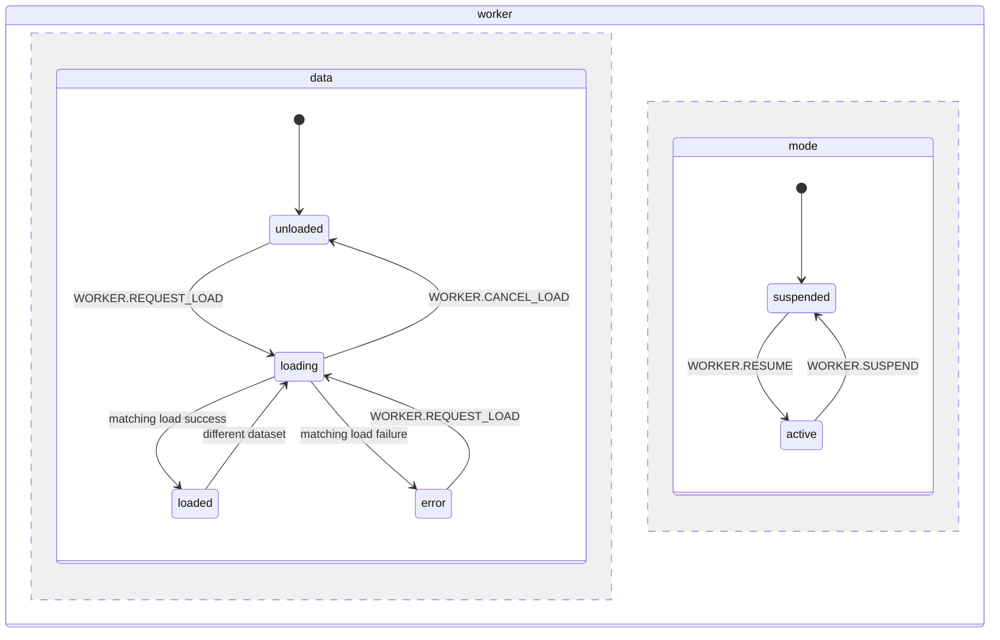
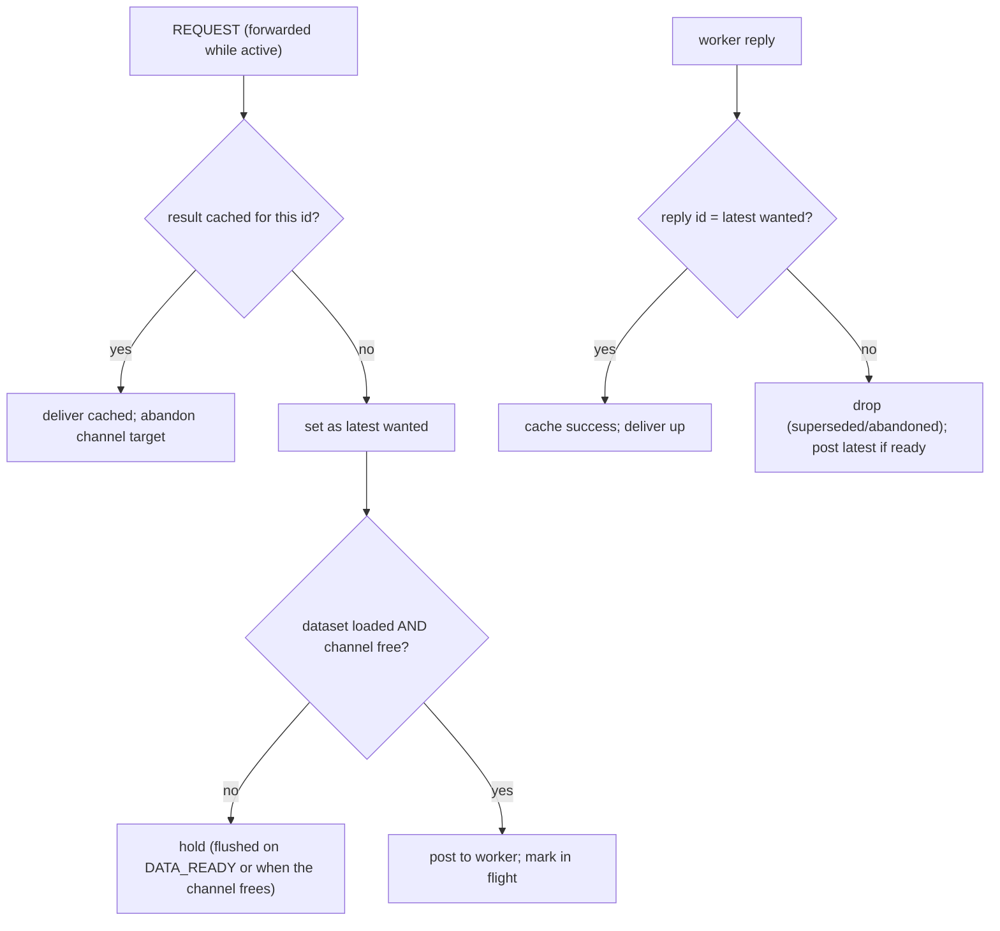

# Runtime Orchestration

This document contains actor diagrams and runtime sequences for Plainsight.

It does not replace [Architecture](architecture.md). Architecture explains the
system shape. This file shows how the scene actor system moves at runtime.

Keep this file diagram-first and prose-light. The implementation is the source
of truth.

## Diagram scope

Current diagrams:

1. actor topology;
2. root coordinator state diagram;
3. city navigation sequence.

Add more diagrams only when a runtime interaction is hard to understand from the
architecture overview and ADRs. Do not add one diagram per machine by default.

## Actor topology


```mermaid
flowchart TD
  provider["SceneProvider\nscene session"]
  root["root\nscene coordinator"]

  map["map\nMapLibre lifecycle + interaction"]
  ui["ui\nlens, selection, hover"]
  nav["navigation\nroute intent + commit"]
  worker["worker\nclient compute router"]
  city["city\nactive city lifecycle"]
  transport["transport\nlazy Web Worker pipe"]

  provider --> root

  root -->|"spawned in root context\nscene session"| map
  root -->|"spawned in root context\nscene session"| ui
  root -->|"invoked by root\nscene session"| nav
  root -->|"invoked by root\nscene session"| worker
  root -->|"spawned/replaced\nper active city"| city

  worker -->|"invokes"| transport

  ui -->|"UI.SET_LENS"| city
  ui -->|"MAP.SELECTION_CHANGED"| map
  map -->|"UI.SET_HOVER"| ui
  map -->|"MAP.RESOLUTION_CHANGED"| city
  city -->|"WORKER.REQUEST_*"| worker
  worker -->|"WORKER.* replies"| city
  nav -->|"NAV.STARTED"| root
  city -->|"CITY.READY / CITY.FAILED"| root
```

## Root coordinator

Root owns the city-switch window.


```mermaid
stateDiagram-v2
  [*] --> settled

  settled --> switching: NAV.STARTED / fanSuspend + prefetch
  settled --> settled: URL.SYNC / syncUrl

  switching --> switching: NAV.STARTED / fanSuspend + prefetch
  switching --> settled: CITY.READY / fanResume
  switching --> settled: CITY.FAILED / fanResume

  note right of switching
    URL.SYNC is intentionally unhandled.
    Transition-time clears must not clobber the URL.
  end note
```

City replacement is an action-level flow, not a separate root state:


```mermaid
flowchart LR
  changed["CITY.CHANGED"] --> stop["stop old city actor"]
  stop --> spawn["spawn new city actor"]
  spawn --> active["new city owns active slug + snapshot"]
```

The shared worker is not cancelled on replacement: the new city's
identity-aware `WORKER.REQUEST_LOAD` replaces old data only when the dataset
differs (and is acknowledged from cache when it matches a destination prefetch),
while any stale recompute response is rejected by request + snapshot identity.

## City navigation sequence


```mermaid
sequenceDiagram
  autonumber
  participant User as "User"
  participant CityLink as "City link"
  participant Nav as "navigation actor"
  participant Root as "root actor"
  participant Map as "map actor"
  participant UI as "ui actor"
  participant Route as "Next route"
  participant Loader as "SceneUrlLoader"
  participant City as "city actor"
  participant Worker as "worker actor"

  User->>CityLink: choose city
  CityLink->>Nav: NAV.INTENT(path)
  Nav->>Root: NAV.STARTED(path)
  Root->>Map: SUSPEND
  Root->>UI: SUSPEND
  Root->>Worker: WORKER.RESUME + WORKER.REQUEST_LOAD (analyse prefetch)
  Root->>Root: enter switching

  Route->>Nav: NAV.COMMIT(path)
  Nav->>Root: NAV.ENDED(path)

  Loader->>Root: CITY.CHANGED(city, initial filters)
  Root->>City: stop old city actor
  Root->>City: spawn new city actor

  City->>Worker: WORKER.RESUME + WORKER.REQUEST_LOAD (cached ack if prefetched)
  City->>Worker: WORKER.REQUEST_HEXES / WORKER.REQUEST_AGGREGATES
  Worker-->>City: WORKER.FETCH_OK
  Worker-->>City: WORKER.PROCESS_RESULT

  City->>Root: CITY.READY
  Root->>Map: RESUME
  Root->>UI: RESUME
  Root->>Root: enter settled
```

Safety properties:

- map and UI interaction are suppressed before the destination city is ready;
- a replaced city's stale worker work is rejected by request + snapshot identity,
  and a matching destination load is reused rather than cancelled;
- the switching window closes on either `CITY.READY` or `CITY.FAILED`;
- root drops URL writes while switching.

## Worker coordination

The worker machine is a scene-session actor. It owns analytics-data lifecycle,
calculation coordination, and the transport actor that communicates with the
Web Worker. Its `data` and `mode` regions are independent:


```mermaid
stateDiagram-v2
  state worker {
    state data {
      [*] --> unloaded
      unloaded --> loading: WORKER.REQUEST_LOAD
      loading --> unloaded: WORKER.CANCEL_LOAD
      loading --> loaded: matching load success
      loading --> error: matching load failure
      loaded --> loading: different dataset
      error --> loading: WORKER.REQUEST_LOAD
    }
    --
    state mode {
      [*] --> suspended
      suspended --> active: WORKER.RESUME
      active --> suspended: WORKER.SUSPEND
    }
  }
```

Initial state is `data.unloaded + mode.suspended`. Loading is independent of
mode, so Analyse navigation may prefetch a destination dataset before its city
actor exists. The transport creates the Web Worker lazily on its first command
and releases a failed thread so a later load can recreate it.

The machine tracks only the load lifecycle and gates delivery by mode. The
transport actor it invokes owns both the raw worker pipe and a **calculation
controller** — the coalescing, per-type caching, and the hold-until-loaded gate
all live there, not in the machine.

### Data lifecycle

- `WORKER.REQUEST_LOAD` from `unloaded` or `error` records the requested
  slug/snapshot and starts transport loading.
- An identical request in `loading` is deduplicated (it falls through as a
  no-op). A different request cancels the old transport load and loads the new
  dataset. No calculation state is reset on a city switch — the controller needs
  none (see below).
- `WORKER.CANCEL_LOAD` applies only in `loading`; there is no unload event and no
  combined worker-cancel event.
- Only a load response matching the requested slug/snapshot can enter `loaded`
  or `error`. Other load responses are omitted.
- A matching success records the loaded identity, sends `WORKER.FETCH_OK`, and
  sends `DATA_READY` to the transport so the controller flushes any held
  calculations. `WORKER.FETCH_OK` contains only slug and snapshot ID.
- An identical load request in `loaded` immediately acknowledges the current
  city without a transport round-trip. This is how city replacement reuses a
  completed destination prefetch.
- A load failure enters `error`; held calculation intent and completed caches are
  preserved for a same-dataset retry. A worker-thread crash
  (`TRANSPORT.WORKER_ERROR`) enters `error`, routes a fatal to the city, and — in
  the transport actor, before the machine sees the event — resets the controller
  (channels cleared and loaded-dataset forgotten, cache kept for instant
  recovery).

### Calculation coordination (controller)

While `active`, the machine forwards each `WORKER.REQUEST_*` to the transport as
a `REQUEST` command and routes delivered results to the current city. The
controller keeps one channel per process type (hexes, aggregates):

```text
latestRequestedMessage  the newest request the city wants (also the reply match-key)
hasRequestInFlight      whether one worker calculation is physically outstanding
```

plus a per-type result cache and the current loaded-dataset identity. The request
ID is deterministic over process type, slug, snapshot ID, and normalized
parameters — both the deduplication key and the reply identity. Because it
encodes city identity, a cached entry or reply from a previous city never falsely
matches.


```mermaid
flowchart TD
  request["REQUEST (forwarded while active)"] --> cache{"result cached for this id?"}
  cache -- yes --> deliver["deliver cached; abandon channel target"]
  cache -- no --> latest["set as latest wanted"]
  latest --> ready{"dataset loaded AND channel free?"}
  ready -- no --> hold["hold (flushed on DATA_READY or when the channel frees)"]
  ready -- yes --> post["post to worker; mark in flight"]

  response["worker reply"] --> match{"reply id = latest wanted?"}
  match -- yes --> settle["cache success; deliver up"]
  match -- no --> drop["drop (superseded/abandoned); post latest if ready"]
```

At most one calculation per type is outstanding; newer intent replaces the target
rather than queuing worker work. A request whose dataset is not yet loaded is held
and flushed on `DATA_READY`. A city switch needs no explicit reset: newest-wins
overwrites the target, the loaded-dataset gate holds a stale target, the reply-id
match drops the old city's in-flight reply, and the city's own slug check is the
backstop. Because the worker is single-threaded, a shared channel serializes the
new city's calculation behind the old city's in-flight one (equivalent
wall-clock; only the timing of the post differs).

Delivery is gated by `mode`. While `suspended` the machine forwards no requests
and drops delivered results, but the controller keeps settling and caching, so
resuming and re-requesting serves from cache. Only a worker crash resets the
controller.

### Consumer sequence

Analyse entry sends:

```text
WORKER.RESUME
WORKER.REQUEST_LOAD
WORKER.REQUEST_HEXES
WORKER.REQUEST_AGGREGATES
```

The calculation requests are sent immediately rather than waiting for city or
map readiness. Browse entry sends `WORKER.SUSPEND` and no calculation requests.
Root city replacement does not cancel the shared worker; the new city's
identity-aware load either replaces old data or reuses the matching prefetch.
The city actor independently checks slug and snapshot identity before accepting
worker replies.

## Future diagram candidates

Add these only if the implementation becomes hard to follow without them:

- map parallel lifecycle/interaction state diagram;
- URL hydration/write-sync sequence;
- Analyse recomputation sequence.

If added, each diagram should stay focused on one concern and use real event
names from the machines.
